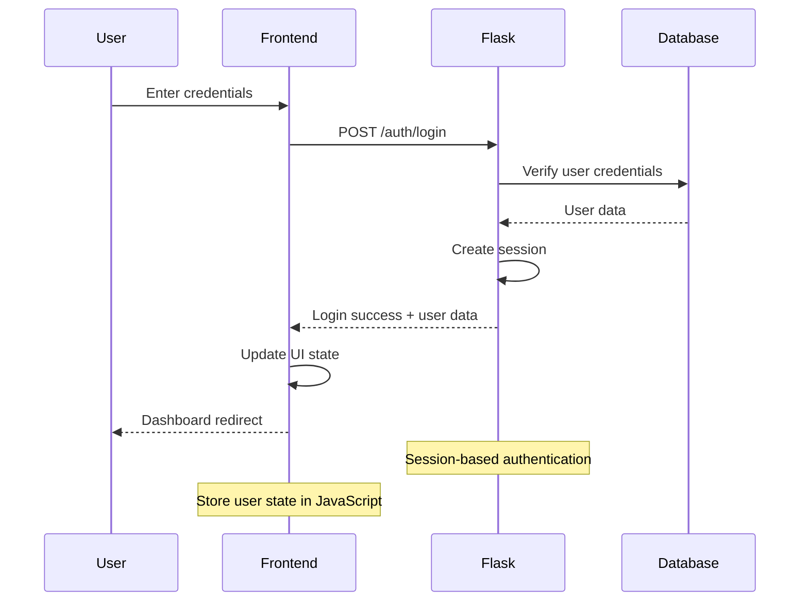

# Backend Architecture

## Service Architecture

### Controller Organization
```
app/
├── __init__.py              # Flask app factory
├── models/                  # SQLAlchemy models
│   ├── __init__.py
│   ├── user.py
│   ├── client.py
│   ├── device.py
│   ├── work_order.py
│   └── material.py
├── views/                   # Blueprint controllers
│   ├── __init__.py
│   ├── auth.py             # Authentication routes
│   ├── dashboard.py        # Dashboard routes
│   ├── clients.py          # Client management
│   ├── devices.py          # Device management
│   ├── work_orders.py      # Work order management
│   ├── admin.py            # Admin-only routes
│   └── api.py              # REST API endpoints
├── services/               # Business logic layer
│   ├── __init__.py
│   ├── auth_service.py
│   ├── client_service.py
│   ├── device_service.py
│   ├── work_order_service.py
│   ├── qr_service.py
│   └── email_service.py
├── utils/                  # Utility functions
│   ├── __init__.py
│   ├── validators.py
│   ├── helpers.py
│   └── decorators.py
└── config.py               # Configuration
```

### Controller Template
```python
# Example: Client management controller
from flask import Blueprint, render_template, request, jsonify, flash, redirect, url_for
from flask_login import login_required, current_user
from app.services.client_service import ClientService
from app.utils.decorators import role_required
from app.forms.client_forms import ClientForm

clients_bp = Blueprint('clients', __name__, url_prefix='/clients')

@clients_bp.route('/')
@login_required
def index():
    """Client list page"""
    search = request.args.get('search', '')
    tip = request.args.get('tip', '')
    
    clients = ClientService.get_clients(
        search=search, 
        tip=tip, 
        user=current_user
    )
    
    return render_template('clients/list.html', 
                         clients=clients, 
                         search=search, 
                         tip=tip)

@clients_bp.route('/new', methods=['GET', 'POST'])
@login_required
def create():
    """Create new client"""
    form = ClientForm()
    
    if form.validate_on_submit():
        try:
            client = ClientService.create_client(form.data, current_user)
            flash('Klijent je uspešno kreiran.', 'success')
            return redirect(url_for('clients.detail', id=client.id))
        except Exception as e:
            flash(f'Greška: {str(e)}', 'error')
    
    return render_template('clients/form.html', form=form)

@clients_bp.route('/<int:id>')
@login_required  
def detail(id):
    """Client details page"""
    client = ClientService.get_client_by_id(id, current_user)
    if not client:
        flash('Klijent nije pronađen.', 'error')
        return redirect(url_for('clients.index'))
    
    return render_template('clients/detail.html', client=client)

# API endpoints
@clients_bp.route('/api/clients', methods=['GET'])
@login_required
def api_get_clients():
    """API endpoint for getting clients"""
    try:
        filters = {
            'search': request.args.get('search', ''),
            'tip': request.args.get('tip', '')
        }
        
        clients = ClientService.get_clients_api(filters, current_user)
        return jsonify(clients)
    except Exception as e:
        return jsonify({'error': str(e)}), 500

@clients_bp.route('/api/clients', methods=['POST'])
@login_required
def api_create_client():
    """API endpoint for creating client"""
    try:
        data = request.get_json()
        client = ClientService.create_client_api(data, current_user)
        return jsonify(client), 201
    except ValueError as e:
        return jsonify({'error': str(e)}), 400
    except Exception as e:
        return jsonify({'error': 'Interna greška servera'}), 500
```

## Database Architecture

### Schema Design
```sql
-- User table
CREATE TABLE users (
    id INT PRIMARY KEY AUTO_INCREMENT,
    ime VARCHAR(100) NOT NULL,
    prezime VARCHAR(100) NOT NULL,
    email VARCHAR(255) UNIQUE NOT NULL,
    password_hash VARCHAR(255) NOT NULL,
    tip ENUM('administrator', 'serviser') NOT NULL,
    aktivan BOOLEAN DEFAULT TRUE,
    created_at TIMESTAMP DEFAULT CURRENT_TIMESTAMP,
    updated_at TIMESTAMP DEFAULT CURRENT_TIMESTAMP ON UPDATE CURRENT_TIMESTAMP,
    INDEX idx_email (email),
    INDEX idx_tip (tip)
);

-- Client table
CREATE TABLE clients (
    id INT PRIMARY KEY AUTO_INCREMENT,
    naziv VARCHAR(255) NOT NULL,
    tip ENUM('pravno_lice', 'fizicko_lice') NOT NULL,
    adresa VARCHAR(255) NOT NULL,
    mesto VARCHAR(100) NOT NULL,
    postanski_broj VARCHAR(10),
    drzava VARCHAR(100) DEFAULT 'Srbija',
    telefon VARCHAR(50),
    email VARCHAR(255),
    pib VARCHAR(20),
    mb VARCHAR(20),
    created_at TIMESTAMP DEFAULT CURRENT_TIMESTAMP,
    updated_at TIMESTAMP DEFAULT CURRENT_TIMESTAMP ON UPDATE CURRENT_TIMESTAMP,
    INDEX idx_naziv (naziv),
    INDEX idx_tip (tip),
    INDEX idx_email (email)
);

-- Locations table
CREATE TABLE locations (
    id INT PRIMARY KEY AUTO_INCREMENT,
    client_id INT NOT NULL,
    naziv VARCHAR(255) NOT NULL,
    adresa VARCHAR(255) NOT NULL,
    mesto VARCHAR(100) NOT NULL,
    postanski_broj VARCHAR(10),
    drzava VARCHAR(100) DEFAULT 'Srbija',
    kontakt_osoba VARCHAR(255),
    telefon VARCHAR(50),
    email VARCHAR(255),
    created_at TIMESTAMP DEFAULT CURRENT_TIMESTAMP,
    FOREIGN KEY (client_id) REFERENCES clients(id) ON DELETE CASCADE,
    INDEX idx_client_id (client_id)
);

-- Objects table
CREATE TABLE objects (
    id INT PRIMARY KEY AUTO_INCREMENT,
    location_id INT NOT NULL,
    naziv VARCHAR(255) NOT NULL,
    created_at TIMESTAMP DEFAULT CURRENT_TIMESTAMP,
    FOREIGN KEY (location_id) REFERENCES locations(id) ON DELETE CASCADE,
    INDEX idx_location_id (location_id)
);

-- Rooms table
CREATE TABLE rooms (
    id INT PRIMARY KEY AUTO_INCREMENT,
    object_id INT NOT NULL,
    naziv VARCHAR(255),
    numerica_oznaka VARCHAR(50),
    created_at TIMESTAMP DEFAULT CURRENT_TIMESTAMP,
    FOREIGN KEY (object_id) REFERENCES objects(id) ON DELETE CASCADE,
    INDEX idx_object_id (object_id)
);

-- Devices table
CREATE TABLE devices (
    id INT PRIMARY KEY AUTO_INCREMENT,
    room_id INT NOT NULL,
    proizvodjac VARCHAR(255) NOT NULL,
    model VARCHAR(255) NOT NULL,
    serijski_broj VARCHAR(255),
    inventarski_broj VARCHAR(255),
    godina_proizvodnje INT,
    tip ENUM('rashladna_tehnika', 'grejna_tehnika', 'ventilacioni_sistemi') NOT NULL,
    podtip VARCHAR(100),
    jedinstveni_id VARCHAR(50) UNIQUE NOT NULL,
    garantni_rok_meseci INT,
    created_at TIMESTAMP DEFAULT CURRENT_TIMESTAMP,
    updated_at TIMESTAMP DEFAULT CURRENT_TIMESTAMP ON UPDATE CURRENT_TIMESTAMP,
    FOREIGN KEY (room_id) REFERENCES rooms(id) ON DELETE CASCADE,
    INDEX idx_room_id (room_id),
    INDEX idx_jedinstveni_id (jedinstveni_id),
    INDEX idx_tip (tip)
);

-- Work orders table
CREATE TABLE work_orders (
    id INT PRIMARY KEY AUTO_INCREMENT,
    broj_naloga VARCHAR(50) UNIQUE NOT NULL,
    client_id INT NOT NULL,
    location_id INT NOT NULL,
    status ENUM('u_radu', 'zavrsen', 'fakturisan', 'otkazan') DEFAULT 'u_radu',
    datum_otvaranja TIMESTAMP DEFAULT CURRENT_TIMESTAMP,
    datum_zatvaranja TIMESTAMP NULL,
    broj_naloga_narucioca VARCHAR(100),
    porudzbenica VARCHAR(255),
    napomena_servisa TEXT,
    ukupan_broj_norma_sati INT DEFAULT 0,
    created_at TIMESTAMP DEFAULT CURRENT_TIMESTAMP,
    updated_at TIMESTAMP DEFAULT CURRENT_TIMESTAMP ON UPDATE CURRENT_TIMESTAMP,
    FOREIGN KEY (client_id) REFERENCES clients(id),
    FOREIGN KEY (location_id) REFERENCES locations(id),
    INDEX idx_broj_naloga (broj_naloga),
    INDEX idx_client_id (client_id),
    INDEX idx_status (status),
    INDEX idx_datum_otvaranja (datum_otvaranja)
);

-- Work order items table  
CREATE TABLE work_order_items (
    id INT PRIMARY KEY AUTO_INCREMENT,
    work_order_id INT NOT NULL,
    device_id INT NOT NULL,
    tip ENUM('servis', 'popravka', 'montaza') NOT NULL,
    vrsta_servisa VARCHAR(100),
    napomena TEXT,
    datum_izvrsavanja TIMESTAMP DEFAULT CURRENT_TIMESTAMP,
    FOREIGN KEY (work_order_id) REFERENCES work_orders(id) ON DELETE CASCADE,
    FOREIGN KEY (device_id) REFERENCES devices(id),
    INDEX idx_work_order_id (work_order_id),
    INDEX idx_device_id (device_id),
    INDEX idx_tip (tip)
);

-- Materials table
CREATE TABLE materials (
    id INT PRIMARY KEY AUTO_INCREMENT,
    naziv VARCHAR(255) NOT NULL,
    jedinica_mere VARCHAR(50) NOT NULL,
    created_at TIMESTAMP DEFAULT CURRENT_TIMESTAMP,
    INDEX idx_naziv (naziv)
);

-- Material usage table
CREATE TABLE material_usage (
    id INT PRIMARY KEY AUTO_INCREMENT,
    work_order_item_id INT NOT NULL,
    material_id INT NOT NULL,
    kolicina DECIMAL(10,2) NOT NULL,
    serijski_broj VARCHAR(255),
    ostali_podaci TEXT,
    FOREIGN KEY (work_order_item_id) REFERENCES work_order_items(id) ON DELETE CASCADE,
    FOREIGN KEY (material_id) REFERENCES materials(id),
    INDEX idx_work_order_item_id (work_order_item_id),
    INDEX idx_material_id (material_id)
);

-- Vehicles table
CREATE TABLE vehicles (
    id INT PRIMARY KEY AUTO_INCREMENT,
    marka VARCHAR(100) NOT NULL,
    model VARCHAR(100) NOT NULL,
    registracija VARCHAR(50) UNIQUE NOT NULL,
    created_at TIMESTAMP DEFAULT CURRENT_TIMESTAMP,
    INDEX idx_registracija (registracija)
);

-- Work order servicer assignment (many-to-many)
CREATE TABLE work_order_servicers (
    work_order_id INT NOT NULL,
    user_id INT NOT NULL,
    PRIMARY KEY (work_order_id, user_id),
    FOREIGN KEY (work_order_id) REFERENCES work_orders(id) ON DELETE CASCADE,
    FOREIGN KEY (user_id) REFERENCES users(id) ON DELETE CASCADE
);

-- Work order vehicle assignment (many-to-many)  
CREATE TABLE work_order_vehicles (
    work_order_id INT NOT NULL,
    vehicle_id INT NOT NULL,
    PRIMARY KEY (work_order_id, vehicle_id),
    FOREIGN KEY (work_order_id) REFERENCES work_orders(id) ON DELETE CASCADE,
    FOREIGN KEY (vehicle_id) REFERENCES vehicles(id) ON DELETE CASCADE
);
```

### Data Access Layer
```python
# Repository pattern implementation
from app import db
from app.models.client import Client
from sqlalchemy import or_

class ClientRepository:
    
    @staticmethod
    def find_all(search=None, tip=None, limit=None, offset=None):
        """Find clients with optional filtering"""
        query = Client.query
        
        if search:
            query = query.filter(
                or_(
                    Client.naziv.ilike(f'%{search}%'),
                    Client.email.ilike(f'%{search}%'),
                    Client.mesto.ilike(f'%{search}%')
                )
            )
        
        if tip:
            query = query.filter(Client.tip == tip)
        
        query = query.order_by(Client.naziv)
        
        if limit:
            query = query.limit(limit)
        if offset:
            query = query.offset(offset)
        
        return query.all()
    
    @staticmethod
    def find_by_id(client_id):
        """Find client by ID"""
        return Client.query.get(client_id)
    
    @staticmethod
    def create(client_data):
        """Create new client"""
        client = Client(**client_data)
        db.session.add(client)
        db.session.commit()
        return client
    
    @staticmethod
    def update(client_id, update_data):
        """Update existing client"""
        client = Client.query.get(client_id)
        if not client:
            return None
        
        for key, value in update_data.items():
            setattr(client, key, value)
        
        db.session.commit()
        return client
    
    @staticmethod
    def delete(client_id):
        """Delete client"""
        client = Client.query.get(client_id)
        if not client:
            return False
        
        db.session.delete(client)
        db.session.commit()
        return True
    
    @staticmethod
    def count(search=None, tip=None):
        """Count clients with optional filtering"""
        query = Client.query
        
        if search:
            query = query.filter(
                or_(
                    Client.naziv.ilike(f'%{search}%'),
                    Client.email.ilike(f'%{search}%'),
                    Client.mesto.ilike(f'%{search}%')
                )
            )
        
        if tip:
            query = query.filter(Client.tip == tip)
        
        return query.count()
```

## Authentication and Authorization

### Auth Flow


### Middleware/Guards
```python
# Authentication middleware for API routes
from functools import wraps
from flask import jsonify, session
from flask_login import current_user

def api_auth_required(f):
    """Decorator for API routes requiring authentication"""
    @wraps(f)
    def decorated_function(*args, **kwargs):
        if not current_user.is_authenticated:
            return jsonify({'error': 'Authentifikacija je potrebna'}), 401
        return f(*args, **kwargs)
    return decorated_function

def api_role_required(required_role):
    """Decorator for API routes requiring specific role"""
    def decorator(f):
        @wraps(f)
        def decorated_function(*args, **kwargs):
            if not current_user.is_authenticated:
                return jsonify({'error': 'Authentifikacija je potrebna'}), 401
            
            if (current_user.tip != required_role and 
                current_user.tip != 'administrator'):
                return jsonify({'error': 'Nemate dozvolu'}), 403
            
            return f(*args, **kwargs)
        return decorated_function
    return decorator

# Usage example
@api_bp.route('/admin/users', methods=['GET'])
@api_auth_required
@api_role_required('administrator')
def get_users():
    """API endpoint for getting users - admin only"""
    users = UserService.get_all_users()
    return jsonify([user.to_dict() for user in users])
```
