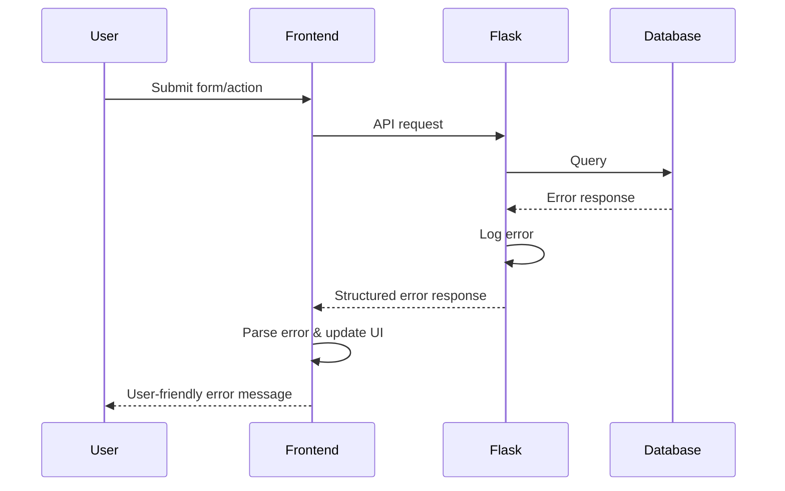

# Error Handling Strategy

## Error Flow


## Error Response Format
```typescript
interface ApiError {
  error: {
    code: string;
    message: string;
    details?: Record<string, any>;
    timestamp: string;
    request_id: string;
  };
}
```

## Frontend Error Handling
```javascript
// Global error handler
class ErrorHandler {
    static handle(error, context = '') {
        console.error(`Error in ${context}:`, error);
        
        // Parse API errors
        if (error.response && error.response.error) {
            this.showUserError(error.response.error.message);
            this.logError(error.response.error);
        } else if (error.message) {
            this.showUserError('Došlo je do greške. Molimo pokušajte ponovo.');
            this.logError({ message: error.message, context });
        } else {
            this.showUserError('Neočekivana greška. Molimo kontaktirajte podršku.');
            this.logError({ error: 'Unknown error', context });
        }
    }
    
    static showUserError(message) {
        // Show user-friendly notification
        const notification = {
            type: 'error',
            message: message,
            duration: 5000
        };
        
        StateManager.setState('ui.notifications', [notification]);
    }
    
    static logError(errorData) {
        // Send error to logging service (optional)
        if (window.errorLoggingEnabled) {
            fetch('/api/log-error', {
                method: 'POST',
                headers: { 'Content-Type': 'application/json' },
                body: JSON.stringify({
                    ...errorData,
                    userAgent: navigator.userAgent,
                    url: window.location.href,
                    timestamp: new Date().toISOString()
                })
            }).catch(() => {
                // Silent fail for logging
            });
        }
    }
}

// Usage in API calls
async function createWorkOrder(workOrderData) {
    try {
        const result = await api.post('/work-orders', workOrderData);
        return result;
    } catch (error) {
        ErrorHandler.handle(error, 'createWorkOrder');
        throw error; // Re-throw for component handling
    }
}
```

## Backend Error Handling
```python
# Global error handlers
from flask import jsonify, request
import logging
import uuid
from datetime import datetime

class KDSException(Exception):
    """Base exception class for KDS system"""
    def __init__(self, message, code='GENERAL_ERROR', details=None):
        self.message = message
        self.code = code
        self.details = details or {}
        super().__init__(self.message)

class ValidationError(KDSException):
    def __init__(self, message, field=None):
        super().__init__(message, 'VALIDATION_ERROR', {'field': field})

class NotFoundError(KDSException):
    def __init__(self, resource, resource_id=None):
        message = f'{resource} nije pronađen'
        if resource_id:
            message += f' (ID: {resource_id})'
        super().__init__(message, 'NOT_FOUND')

# Error handlers registration
def register_error_handlers(app):
    
    @app.errorhandler(KDSException)
    def handle_kds_exception(error):
        request_id = str(uuid.uuid4())
        
        # Log error
        app.logger.error(f'KDS Exception [{request_id}]: {error.message}', 
                        extra={'details': error.details})
        
        return jsonify({
            'error': {
                'code': error.code,
                'message': error.message,
                'details': error.details,
                'timestamp': datetime.utcnow().isoformat(),
                'request_id': request_id
            }
        }), 400
    
    @app.errorhandler(404)
    def handle_not_found(error):
        request_id = str(uuid.uuid4())
        
        if request.path.startswith('/api/'):
            return jsonify({
                'error': {
                    'code': 'NOT_FOUND',
                    'message': 'Endpoint nije pronađen',
                    'timestamp': datetime.utcnow().isoformat(),
                    'request_id': request_id
                }
            }), 404
        
        return render_template('errors/404.html'), 404
    
    @app.errorhandler(500)
    def handle_internal_error(error):
        request_id = str(uuid.uuid4())
        
        # Log detailed error
        app.logger.error(f'Internal Server Error [{request_id}]: {str(error)}')
        
        if request.path.startswith('/api/'):
            return jsonify({
                'error': {
                    'code': 'INTERNAL_ERROR',
                    'message': 'Interna greška servera',
                    'timestamp': datetime.utcnow().isoformat(),
                    'request_id': request_id
                }
            }), 500
        
        return render_template('errors/500.html'), 500

# Usage in services
class ClientService:
    
    @staticmethod
    def get_client_by_id(client_id, user):
        client = ClientRepository.find_by_id(client_id)
        
        if not client:
            raise NotFoundError('Klijent', client_id)
        
        # Additional authorization check
        if user.tip == 'serviser' and not client.accessible_by_user(user):
            raise KDSException('Nemate dozvolu za pristup ovom klijentu', 
                             'ACCESS_DENIED')
        
        return client
    
    @staticmethod
    def create_client(client_data, user):
        try:
            # Validate data
            if not client_data.get('naziv'):
                raise ValidationError('Naziv je obavezan', 'naziv')
            
            if not client_data.get('tip'):
                raise ValidationError('Tip klijenta je obavezan', 'tip')
            
            # Create client
            client = ClientRepository.create(client_data)
            
            app.logger.info(f'Client created: {client.id} by user {user.id}')
            return client
            
        except Exception as e:
            db.session.rollback()
            if isinstance(e, KDSException):
                raise
            else:
                app.logger.error(f'Unexpected error creating client: {str(e)}')
                raise KDSException('Greška pri kreiranju klijenta')
```
