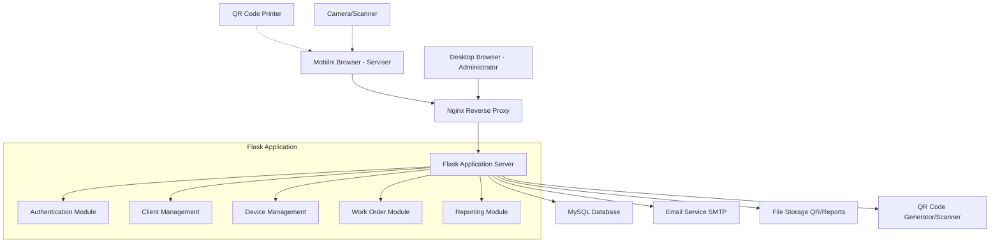

# High Level Architecture

## Technical Summary

KDS sistem koristi tradicionalnu web arhitekturu sa Flask backend-om i Bootstrap frontend-om, optimizovanim za HVAC servisnu industriju. Sistem je dizajniran kao responzivna web aplikacija sa mobile-first pristupom za servisere u terenu i desktop funkcionalnostima za administratore. Ključne tehnološke komponente uključuju MySQL bazu podataka za perzistentne podatke, QR kod funkcionalnost za brzu identifikaciju uređaja, i email sistem za komunikaciju sa klijentima. Arhitektura podržava role-based pristup sa jasnim razdvojenim workflow-ovima za različite tipove korisnika.

## Platform and Infrastructure Choice

**Platform:** Traditional Web Hosting (VPS/Cloud)
**Key Services:** 
- Web server (Nginx/Apache)
- Flask aplikacija server (Gunicorn)
- MySQL baza podataka
- SMTP email servis
- File storage za QR kodove i reporti

**Deployment Host and Regions:** EU region za GDPR compliance

## Repository Structure

**Structure:** Monorepo
**Monorepo Tool:** N/A (standardna Flask struktura)
**Package Organization:** Modularna organizacija po funkcionalnim domenima

## High Level Architecture Diagram

## Architectural Patterns

- **Traditional Web Architecture:** Server-side rendered templates sa client-side enhancements - _Rationale:_ Jednostavnost, brzina development-a i dobra podrška za offline scenarios
- **Model-View-Controller (MVC):** Flask Blueprint organizacija sa jasnim separation of concerns - _Rationale:_ Maintainability i scalability koda
- **Repository Pattern:** Abstraktni data access layer - _Rationale:_ Testabilnost i mogućnost promene baze podataka
- **Role-Based Access Control:** Različiti nivoi pristupa za administratore i servisere - _Rationale:_ Sigurnost i user experience optimizacija
- **Progressive Enhancement:** Osnovna funkcionalnost bez JavaScript, poboljšanja sa JS - _Rationale:_ Pouzdanost u različitim network uslovima
