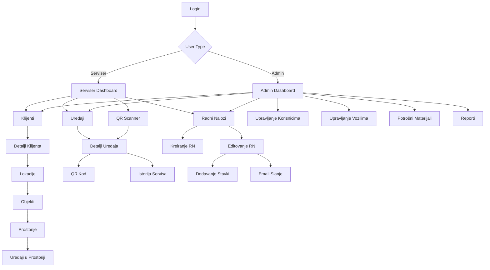
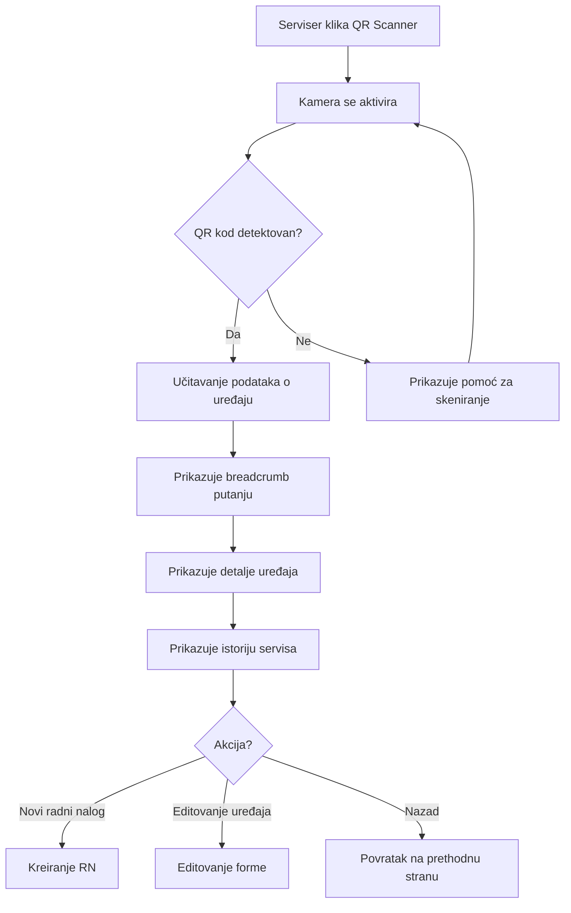
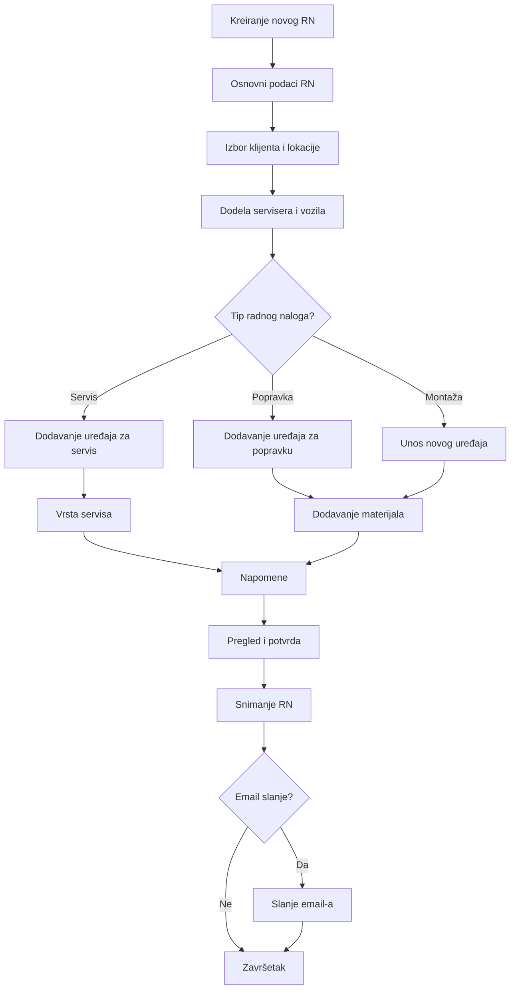
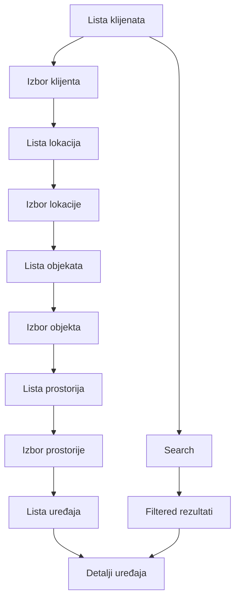

# KDS Sistem UI/UX Specification

## Introduction

Ovaj dokument definiše korisničko iskustvo, informacionu arhitekturu, user flow-ove i vizuelnu specifikaciju za KDS (Sistem radnih naloga) aplikaciju. Služi kao osnova za vizuelni dizajn i frontend development, obezbeđujući kohezivno i user-centered iskustvo za upravljanje servisima HVAC uređaja.

### Overall UX Goals & Principles

#### Target User Personas

**Serviser - Marko (Primarni korisnik)**
- **Profil**: Tehničko osoblje, 25-45 godina, rad u terenu
- **Tehnička pismenost**: Srednja, koristi primarno mobilne uređaje
- **Kontekst korišćenja**: Rad na lokaciji klijenta, često u vremenskom pritisku
- **Potrebe**: Brz pristup podacima o uređajima, jednostavan unos podataka, offline capabilities
- **Frustracije**: Spori sistemi, komplikovani interfejsi, potreba za čestim prekucavanjem

**Administrator - Ana (Sekundarni korisnik)**
- **Profil**: Menadžment/administracija, 30-50 godina, rad u kancelariji
- **Tehnička pismenost**: Napredna, koristi desktop računare
- **Kontekst korišćenja**: Upravljanje operacijama, planiranje, komunikacija sa klijentima
- **Potrebe**: Potpun pregled nad sistemom, detaljni reporti, upravljanje resursima
- **Frustracije**: Nepotpuni podaci, nedostajuće funkcionalnosti za analizu

#### Usability Goals

- **Brzina**: Kreiranje radnog naloga u manje od 3 minuta
- **Efikasnost**: QR kod skeniranje za instant pristup uređaju
- **Jednostavnost**: Intuitivna navigacija kroz hijerarhiju klijenata
- **Pouzdanost**: Offline funkcionalnost za osnovne operacije
- **Preciznost**: Eliminacija grešaka u unosu podataka

#### Design Principles

1. **Mobile-First Approach** - Dizajn prvo za mobilne uređaje, zatim skaliranje za desktop
2. **Touch-Optimized Interface** - Veliki touch targeti, swipe gestures, haptic feedback
3. **Context-Aware Design** - Interfejs se prilagođava kontekstu rada (teren vs kancelarija)
4. **Progressive Disclosure** - Prikazivanje relevantnih informacija u pravom trenutku
5. **Visual Hierarchy** - Jasno razlikovanje između primary i secondary akcija
6. **Error Prevention** - Proaktivno sprečavanje grešaka kroz UX design

### Change Log

| Date | Version | Description | Author |
|------|---------|-------------|--------|
| 2024-01-15 | 1.0 | Inicijalna UI/UX specifikacija | UX Expert |

## Information Architecture (IA)

### Site Map / Screen Inventory

### Navigation Structure

**Primary Navigation (Glavna navigacija):**
- **Serviseri**: Bottom tab bar sa 4 glavne sekcije (Dashboard, Klijenti, Uređaji, Radni Nalozi)
- **Administratori**: Side navigation sa expanded menu struktura

**Secondary Navigation (Sekundarna navigacija):**
- Breadcrumb navigacija za hijerarhiju klijenata
- Context menus za quick actions
- Search overlays za brzu pretragu

**Breadcrumb Strategy:**
Uvek prikazana putanja: Klijent → Lokacija → Objekat → Prostorija → Uređaj

## User Flows

### QR Kod Skeniranje i Pristup Uređaju

**User Goal:** Brz pristup informacijama o uređaju preko QR koda

**Entry Points:** 
- QR Scanner dugme na dashboard-u
- QR ikon u radnom nalogu
- "Skeniraj QR" opcija pri dodavanju uređaja

**Success Criteria:** Uspešno skeniranje i prikaz informacija o uređaju u manje od 5 sekundi

#### Flow Diagram

#### Edge Cases & Error Handling:
- QR kod nije čitljiv → Prikazuje poruku sa instrukcijama
- Uređaj ne postoji u bazi → Opcija za kreiranje novog uređaja
- Nema internet konekcije → Čuva QR kod za kasnije sinhronizaciju
- Pogrešan QR kod format → Clear error message sa retry opcijom

**Notes:** Prioritet na brzini i jasnoći - veliki QR viewfinder, instant feedback

### Kreiranje Radnog Naloga

**User Goal:** Kreiranje novog radnog naloga sa dodavanjem uređaja i materijala

**Entry Points:**
- "Novi Radni Nalog" dugme na dashboard-u
- "Kreiraj RN" opcija iz detalja uređaja
- Quick action iz liste klijenata

**Success Criteria:** Kompletan radni nalog kreiran i sačuvan u manje od 5 minuta

#### Flow Diagram

#### Edge Cases & Error Handling:
- Obavezna polja nisu popunjena → Inline validacija sa clear porukama
- Klijent nema lokacije → Auto-kreiranje prve lokacije
- Nema dostupnih materijala → Opcija za dodavanje novog materijala
- Email failed → Retry opcija i offline queue

### Navigacija kroz Hijerarhiju Klijenata

**User Goal:** Pronalaženje specific uređaja kroz strukturu klijent → lokacija → objekat → prostorija

**Entry Points:**
- Klijenti lista
- Search rezultati
- Breadcrumb navigacija

**Success Criteria:** Pronalaženje target uređaja u manje od 6 tap-ova

#### Flow Diagram

## Component Library / Design System

### Design System Approach

**Korišćenje Bootstrap 5 component library** sa custom ekstenzijama optimizovanim za HVAC servisni workflow

### Core Components

#### Navigation Components

**Bottom Tab Bar (Mobile)**
- **Purpose:** Glavna navigacija za servisere
- **Variants:** 4-tab layout (Dashboard, Klijenti, Uređaji, RN)
- **States:** Active, Inactive, Badge notifications
- **Usage Guidelines:** Uvek visible, highlight active sekciju

**Breadcrumb Navigation**
- **Purpose:** Hijerarhijska navigacija kroz klijent strukturu
- **Variants:** Collapsible na mobilnim uređajima
- **States:** Normal, Collapsed, Loading
- **Usage Guidelines:** Maksimalno 5 nivoa, touch-friendly

#### Data Entry Components

**QR Scanner Interface**
- **Purpose:** Skeniranje QR kodova za uređaje
- **Variants:** Full-screen overlay sa camera feed
- **States:** Scanning, Success, Error, Permission denied
- **Usage Guidelines:** Large viewfinder, clear instructions

**Smart Forms**
- **Purpose:** Adaptive forme za različite tipove podataka
- **Variants:** Device forms, Client forms, Work order forms
- **States:** Empty, Filled, Validation error, Success
- **Usage Guidelines:** Progressive disclosure, inline validation

#### Display Components

**Device Card**
- **Purpose:** Prikaz osnovnih informacija o uređaju
- **Variants:** Compact (lista), Expanded (detalji)
- **States:** Normal, Selected, Service needed
- **Usage Guidelines:** Swipe actions za quick opcije

**Work Order Status**
- **Purpose:** Visual prikaz statusa radnih naloga
- **Variants:** Badge, Progress bar, Status card
- **States:** U radu, Završen, Fakturisan, Otkazan
- **Usage Guidelines:** Color-coded sa clear labeling

## Branding & Style Guide

### Visual Identity

**Brand Guidelines:** Clean, profesionalan dizajn koji odražava pouzdanost i efikasnost

### Color Palette

| Color Type | Hex Code | Usage |
|------------|----------|-------|
| Primary | #007BFF | Main actions, links, active states |
| Secondary | #6C757D | Secondary information, inactive states |
| Success | #28A745 | Successful operations, completed tasks |
| Warning | #FFC107 | Important notices, pending actions |
| Error | #DC3545 | Errors, critical warnings |
| Info | #17A2B8 | Informational content, tips |
| Light | #F8F9FA | Background, card backgrounds |
| Dark | #343A40 | Text, borders, contrasts |

### Typography

#### Font Families
- **Primary:** Inter (Web-safe alternative: Arial, sans-serif)
- **Monospace:** Fira Code (Web-safe alternative: Consolas, monospace)

#### Type Scale

| Element | Size | Weight | Line Height |
|---------|------|--------|-------------|
| H1 | 2.5rem | 700 | 1.2 |
| H2 | 2rem | 600 | 1.3 |
| H3 | 1.75rem | 600 | 1.4 |
| Body | 1rem | 400 | 1.5 |
| Small | 0.875rem | 400 | 1.4 |

### Iconography

**Icon Library:** Bootstrap Icons sa custom HVAC specifični ikoni

**Usage Guidelines:** 
- 24px touch target minimum
- Consistent stroke width
- Clear labeling

### Spacing & Layout

**Grid System:** Bootstrap 12-column grid

**Spacing Scale:** 0.25rem, 0.5rem, 1rem, 1.5rem, 3rem (Bootstrap spacing utilities)

## Accessibility Requirements

### Compliance Target

**Standard:** WCAG 2.1 AA compliance

### Key Requirements

**Visual:**
- Color contrast ratios: 4.5:1 za normal text, 3:1 za large text
- Focus indicators: 2px solid outline na sve interactive elemente
- Text sizing: Podržava zoom do 200% bez horizontalnog skrolovanja

**Interaction:**
- Keyboard navigation: Tab order logically flows kroz sve interaktivne elemente
- Screen reader support: Semantic HTML i ARIA labels za sve komponente
- Touch targets: Minimum 44px za sve touch elementi

**Content:**
- Alternative text: Opisni alt text za sve slike i QR kodove
- Heading structure: Hijerarhijska struktura H1-H6
- Form labels: Eksplicitni label-i za sve form kontrole

### Testing Strategy

Accessibility testiranje integrisano u development workflow sa automatskim i manual testing

## Responsiveness Strategy

### Breakpoints

| Breakpoint | Min Width | Max Width | Target Devices |
|------------|-----------|-----------|----------------|
| Mobile | 320px | 767px | Smartphones, serviseri u terenu |
| Tablet | 768px | 991px | Tablets, hybrid usage |
| Desktop | 992px | 1199px | Laptops, administratori |
| Wide | 1200px | - | Large monitors, power users |

### Adaptation Patterns

**Layout Changes:**
- Mobile: Single column, stacked components
- Tablet: Two column gdzie appropriate
- Desktop: Multi-column layouts sa sidebars

**Navigation Changes:**
- Mobile: Bottom tab bar, hamburger menus
- Desktop: Side navigation, top navigation

**Content Priority:**
- Mobile: Essential actions prominent, secondary content collapsible
- Desktop: More information density, multiple contexts visible

**Interaction Changes:**
- Mobile: Touch-optimized controls, swipe gestures
- Desktop: Hover states, keyboard shortcuts

## Animation & Micro-interactions

### Motion Principles

**Smooth i purposeful** animacije koje poboljšavaju UX bez distrakcije

### Key Animations

- **Page Transitions:** 300ms ease-in-out slide transitions
- **QR Scanner:** Scanning animation sa pulsing effect (Duration: 1000ms, Easing: ease-in-out)
- **Form Validation:** 200ms shake animation za errors (Duration: 200ms, Easing: ease-out)
- **Loading States:** Skeleton screens i spinner animacije (Duration: Indefinite, Easing: linear)
- **Success Actions:** Checkmark animation za completed tasks (Duration: 600ms, Easing: ease-out)

## Performance Considerations

### Performance Goals

- **Page Load:** Manje od 3 sekunde na 3G konekciji
- **Interaction Response:** Manje od 100ms za touch responses
- **Animation FPS:** 60 FPS za sve animacije

### Design Strategies

**Image optimization:** WebP format za sve slike, lazy loading
**Component optimization:** Conditional rendering, virtualized lists za velike data sets
**Offline considerations:** Critical path content cached lokalno

## Next Steps

### Immediate Actions

1. **Validacija sa korisnicima:** User testiranje key flow-ova
2. **Kreiranje wireframes:** Detaljni wireframes za svaki screen
3. **Prototype development:** Interactive prototype za validation
4. **Handoff za arhitekta:** Frontend architecture specifikacija

### Design Handoff Checklist

- [x] All user flows documented
- [x] Component inventory complete
- [x] Accessibility requirements defined
- [x] Responsive strategy clear
- [x] Brand guidelines incorporated
- [x] Performance goals established

## Checklist Results

*Ovaj deo će biti popunjen nakon izvršavanja UI/UX checklist-a*